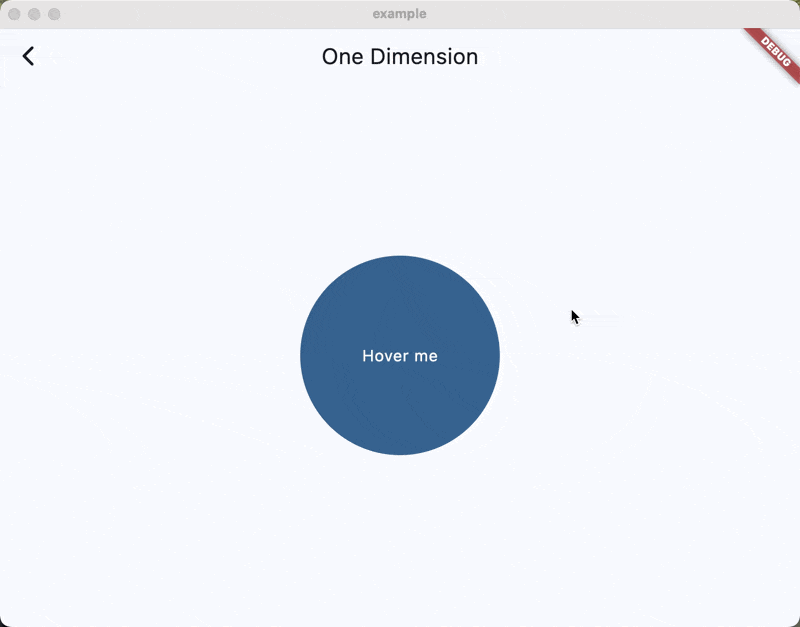
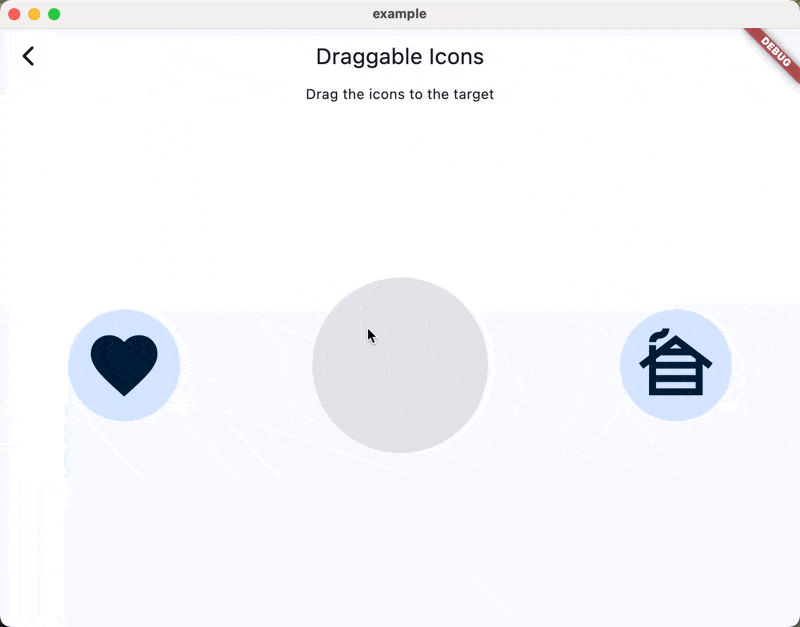

# Motor

[](https://pub.dev/packages/motor)
[](./test/)
[![lintervention_badge]]([lintervention_link])
[](https://bsky.app/profile/i.madethese.works)

A unified motion system that brings together physics-based springs, duration-based curves, and Flutter's animation system under one consistent API.

## Features 🎯

- 🎨 **Unified Motion API** - One consistent interface for springs, curves, and custom motions
- 💡 **Physics & Duration Based** - Choose between spring physics or traditional duration/curve animations
- 🍎 **Apple Design System** - Built-in CupertinoMotion presets matching iOS animations
- 🎨 **Material Design 3** - MaterialSpringMotion tokens following Google's motion guidelines
- 📱 **Multi-dimensional** - Animate complex types like Offset, Size, and Rect with independent physics per dimension
- 🔄 **Interactive Widgets** - Motion-driven draggable widgets with natural return animations
- 🎯 **Flutter Integration** - Works seamlessly with existing Flutter animation patterns

## Try it out
[Open Example](https://whynotmake-it.github.io/rivership/#/motor)

## Installation 💻

**❗ In order to start using Motor you must have the [Dart SDK][dart_install_link] installed on your machine.**

Add to your `pubspec.yaml`:

```yaml
dependencies:
  motor: ^1.0.0-dev.0
```

Or install via `dart pub`:

```sh
dart pub add motor
```

## Usage 💡

### Motion

The core of Motor's unified motion system is the `Motion` class. It represents the **type of motion** that will drive your animation, whether physics-based or duration-based.

```dart
// Duration-based motion (traditional Flutter approach)
final linear = LinearMotion(Duration(seconds: 1));

final withCurve = CurvedMotion(
  duration: Duration(seconds: 1), 
  curve: Curves.easeInOut,
);

// Physics-based motion (natural, responsive)
final spring = CupertinoMotion.bouncy();
final material = MaterialSpringMotion.standardSpatialDefault;
```

Motor provides several motion types out of the box, with the ability to create custom motions by implementing the `Motion` interface:

- **`CurvedMotion`** - Traditional duration-based motion with curves. Perfect for predictable, timed animations.
- **`LinearMotion`** - Like `CurvedMotion` but always linear.
- **`SpringMotion`** - Physics-based motion using Flutter SDK's SpringDescription. Provides natural, responsive animations that feel alive.
- **`CupertinoMotion`** - Predefined spring configurations matching Apple's design system.
- **`MaterialSpringMotion`** - Material Design 3 spring motion tokens for expressive animations.

This unified approach means you can easily switch between physics and duration-based animations without changing your widget code.

### CupertinoMotion

`CupertinoMotion` is a subclass of `SpringMotion` that provides predefined spring configurations matching Apple's design system. These motions are designed to feel natural and familiar to iOS users, as they mirror the spring animations used throughout Apple's platforms.

`CupertinoMotion` offers several predefined constants that correspond to [SwiftUI's animation presets](https://developer.apple.com/documentation/swiftui/animation):

- **`CupertinoMotion()`** - The default iOS spring with smooth motion and no bounce
- **`CupertinoMotion.smooth()`** - A [smooth spring animation](https://developer.apple.com/documentation/swiftui/animation/smooth) with no bounce, ideal for subtle transitions
- **`CupertinoMotion.bouncy()`** - A [bouncy spring](https://developer.apple.com/documentation/swiftui/animation/bouncy) with higher bounce, perfect for playful interactions
- **`CupertinoMotion.snappy()`** - A [snappy spring](https://developer.apple.com/documentation/swiftui/animation/snappy) with small bounce that feels responsive
- **`CupertinoMotion.interactive()`** - An [interactive spring](https://developer.apple.com/documentation/swiftui/animation/interactivespring(response:dampingfraction:blendduration:)) with lower response, designed for user-driven animations

You can also create custom `CupertinoMotion` instances:

```dart
final customMotion = CupertinoMotion(
  duration: Duration(milliseconds: 600),
  bounce: 0.3,
);
```

Since `CupertinoMotion` extends `SpringMotion` (which extends `Motion`), you can use it directly wherever a `Motion` is expected.

### MaterialSpringMotion

`MaterialSpringMotion` provides Material Design 3 spring motion tokens for creating expressive and natural animations that follow Google's design guidelines. The tokens are organized into two main categories with three speed variants each:

**Spatial Motion** - For animating position, size, and layout changes:
- **`MaterialSpringMotion.standardSpatialFast`** - Quick spatial animations (damping: 0.9, stiffness: 1400)
- **`MaterialSpringMotion.standardSpatialDefault`** - Balanced spatial animations (damping: 0.9, stiffness: 700)
- **`MaterialSpringMotion.standardSpatialSlow`** - Gentle spatial animations (damping: 0.9, stiffness: 300)
- **`MaterialSpringMotion.expressiveSpatialFast`** - Dynamic spatial with bounce (damping: 0.6, stiffness: 800)
- **`MaterialSpringMotion.expressiveSpatialDefault`** - Moderate expressive spatial (damping: 0.8, stiffness: 380)
- **`MaterialSpringMotion.expressiveSpatialSlow`** - Gentle expressive spatial (damping: 0.8, stiffness: 200)

**Effects Motion** - For animating visual properties like opacity and color:
- **`MaterialSpringMotion.standardEffectsFast`** - Quick effects animations (damping: 1, stiffness: 3800)
- **`MaterialSpringMotion.standardEffectsDefault`** - Balanced effects animations (damping: 1, stiffness: 1600)
- **`MaterialSpringMotion.standardEffectsSlow`** - Gentle effects animations (damping: 1, stiffness: 800)
- **`MaterialSpringMotion.expressiveEffectsFast`** - Quick expressive effects (damping: 1, stiffness: 3800)
- **`MaterialSpringMotion.expressiveEffectsDefault`** - Moderate expressive effects (damping: 1, stiffness: 1600)
- **`MaterialSpringMotion.expressiveEffectsSlow`** - Gentle expressive effects (damping: 1, stiffness: 800)

You can also create custom `MaterialSpringMotion` instances:

```dart
final customMaterial = MaterialSpringMotion(
  damping: 0.8,
  stiffness: 500,
);
```

These motion tokens follow the [Material Design 3 Motion Guidelines](https://m3.material.io/styles/motion/overview/how-it-works#spring-tokens) and are designed to create consistent, expressive animations across Material Design applications.

### Simple Animation

Use `SingleMotionBuilder` for basic, one-dimensional animations:



```dart
SingleMotionBuilder(
  motion: CupertinoMotion.bouncy(),
  value: targetValue, // Changes trigger smooth spring animation
  builder: (context, value, child) {
    return Container(
      width: value,
      height: value,
      color: Colors.blue,
    );
  },
)
```

If you want to animate more complex types, such as `Offset`, `Size`, or `Rect`, you can use `MotionBuilder` and pass a so-called `MotionConverter` to it:


```dart
MotionBuilder(
  motion: CupertinoMotion.bouncy(),
  value: const Offset(100, 100),
  from: Offset.zero,
  converter: OffsetMotionConverter(),
  builder: (context, value, child) {
    return Transform.translate(
      offset: value,
      child: child,
    );
  },
  child: Container(
    width: 100,
    height: 100,
    color: Colors.blue,
  ),
)
```

For Material Design applications, you can use MaterialSpringMotion tokens:

```dart
MotionBuilder(
  motion: MaterialSpringMotion.expressiveSpatialDefault,
  value: const Offset(100, 100),
  from: Offset.zero,
  converter: OffsetMotionConverter(),
  builder: (context, value, child) {
    return Transform.translate(
      offset: value,
      child: child,
    );
  },
  child: Container(
    width: 100,
    height: 100,
    color: Colors.green,
  ),
)
```


### MotionConverter

One of Motor's key advantages is its ability to animate complex types with **independent motion per dimension**. While Flutter's basic animation system typically uses single animations with `Tween`s, Motor's unified motion system can simulate each dimension independently.

This is crucial for natural-feeling animations. For example, when animating a draggable icon, the user might fling it horizontally (high horizontal velocity) while it settles vertically (low vertical velocity). Traditional single-animation approaches would lose this dimensional independence, making the motion feel artificial.

`MotionConverter`s solve this by breaking any type into multiple dimensions, allowing each dimension to follow the same motion pattern but with independent physics simulation.

This works with **any motion type** - whether you're using spring physics or duration-based curves, each dimension animates independently for maximum fidelity.

For often-used Flutter types, these are already implemented:

- `OffsetMotionConverter`
- `SizeMotionConverter`
- `RectMotionConverter`
- `AlignmentMotionConverter`

However, you might want your very custom type to be animated as well. For this, you can implement your own `MotionConverter` and pass it to the `MotionBuilder` constructor.

```dart
class My3DMotionConverter implements MotionConverter<Vector3> {
  @override
  List<double> normalize(Vector3 value) => [value.x, value.y, value.z];

  @override
  Vector3 denormalize(List<double> values) => Vector3(values[0], values[1], values[2]);
}

Widget build(BuildContext context) {
  return MotionBuilder(
    motion: CupertinoMotion.bouncy(),
    value: Vector3(100, 100, 100),
    converter: My3DMotionConverter(),
    // ...
  );
}
```

Or, just use `MotionConverter` directly and pass the converter functions to its constructor:

```dart
final converter = MotionConverter(
  normalize: (value) => [value.x, value.y, value.z],
  denormalize: (values) => Vector3(values[0], values[1], values[2]),
);
```


### Motion Draggable

Motor includes a `MotionDraggable` widget that demonstrates the power of the unified motion system. You can drag widgets around the screen and watch them return with **any motion type** - from bouncy springs to smooth curves.

It works just like Flutter's `Draggable` widget and supports native `DragTarget`s, but with motion-driven return animations and enhanced physics simulation.



```dart
MotionDraggable(
  motion: CupertinoMotion.bouncy(),
  child: Container(
    width: 100,
    height: 100,
    color: Colors.blue,
  ),
  data: 'my-draggable-data',
)
```

### Low-level Motion Control

For maximum control, Motor provides `MotionController` for complex types and `SingleMotionController` for one-dimensional animations. These controllers work with **any motion type** in the unified system.

```dart
final controller = MotionController(
  motion: CupertinoMotion.bouncy(), // or Motion.duration(), etc.
  vsync: this,
);
```

Motion controllers work similarly to Flutter's `AnimationController` but with key advantages:
- **Motion-agnostic**: Switch between springs and curves without changing controller code
- **Velocity preservation**: Maintains velocity when changing targets (crucial for natural motion)
- **Multi-dimensional**: Each dimension can have independent physics simulation

#### Bounded vs. Unbounded Motion

In Flutter, the `AnimationController` can be either bounded or unbounded. `MotionController`s come in both flavors as well, but they differ in key ways:


##### `MotionController`:
- By default, `MotionController`s are unbounded.
- Unbounded `MotionController`s don't have `forward` or `reverse` methods, since they don't make sense in multi-dimensional space.

##### `BoundedMotionController`:
- requires you to specify a `lowerBound` and `upperBound` in the constructor.
- exposes `forward` and `reverse` methods, which internally animate towards the `upperBound` and `lowerBound` respectively.
- will clamp the animation value to be within the bounds, but they can still overshoot as part of their `Motion` simulation.

## Custom Springs 🔧

For predefined spring configurations, see the [`CupertinoMotion`](#cupertinomotion) section above.

You can also create completely custom springs:

```dart
// Using CupertinoMotion constructor
final mySpring = CupertinoMotion(
  duration: Duration(milliseconds: 500),
  bounce: 0.2,   // Bounce amount (-1 to 1)
);

// Or using Flutter SDK's SpringDescription directly
final customSpring = SpringMotion(
  SpringDescription.withDurationAndBounce(
    duration: Duration(milliseconds: 500),
    bounce: 0.2,
  ),
);
```

---

## Acknowledgements

Motor's unified motion system builds upon excellent work from the Flutter community:

- Spring physics implementation was partially adapted from and heavily inspired by [fluid_animations](https://pub.dev/packages/fluid_animations)
- CupertinoMotion presets are designed to match [Apple's SwiftUI animation system](https://developer.apple.com/documentation/swiftui/animation)
- The Motion abstraction unifies concepts from Flutter's animation framework with modern physics-based approaches

[dart_install_link]: https://dart.dev/get-dart
[mason_link]: https://github.com/felangel/mason
[melos_link]: https://github.com/invertase/melos
[lintervention_link]: https://github.com/whynotmake-it/lintervention
[lintervention_badge]: https://img.shields.io/badge/lints_by-lintervention-3A5A40