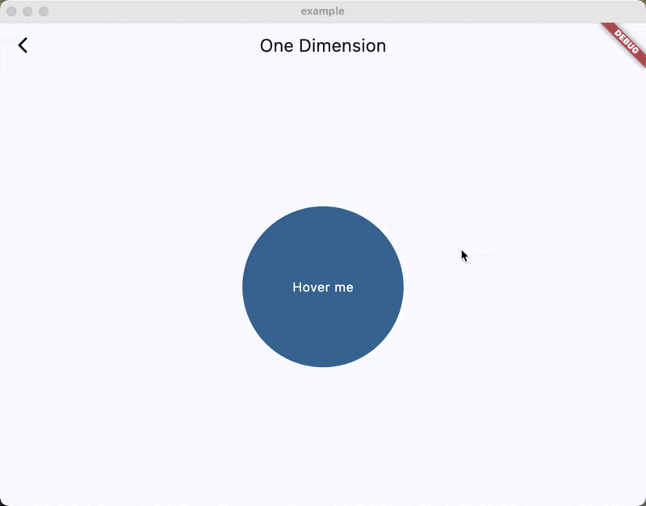
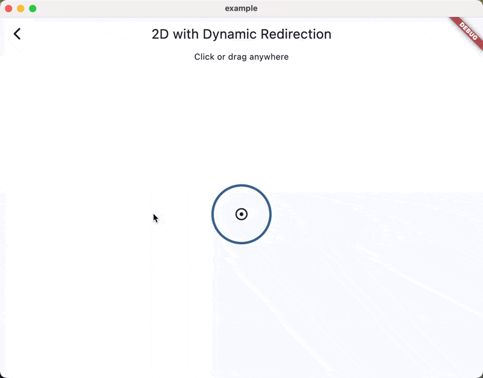
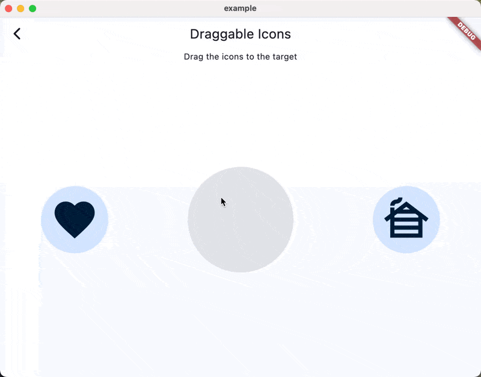

# Motor


[](https://pub.dev/packages/motor)
[](./test/)
[![lintervention_badge]]([lintervention_link])
[](https://bsky.app/profile/i.madethese.works)


A unified motion system that brings together physics-based springs, duration-based curves, and Flutter's animation system under one consistent API.


## Features 🎯

- 🎨 **Unified Motion API** - One consistent interface for springs, curves, and custom motions
- 💡 **Physics & Duration Based** - Choose between spring physics or traditional duration/curve animations
- 🍎 **Apple Design System** - Built-in CupertinoMotion presets matching iOS animations
- 🎨 **Material Design 3** - MaterialSpringMotion tokens following Google's motion guidelines
- 📱 **Multi-dimensional** - Animate complex types like Offset, Size, and Rect with independent physics per dimension
- 🎼 **Tracks & Steps** - Choreograph many properties at once, each with its own multi-step motion
- 🌬️ **Free Motion** - Self-directed physics like friction and decay, with rest-position projection
- 🔄 **Interactive Widgets** - Motion-driven draggable widgets with natural return animations
- 🎯 **Flutter Integration** - Works seamlessly with existing Flutter animation patterns

## Try it out
[Open Example](https://whynotmake-it.github.io/rivership/#/motor)

## Installation 💻

**❗ In order to start using Motor you must have the [Dart SDK][dart_install_link] installed on your machine.**

Add to your `pubspec.yaml`:

```yaml
dependencies:
  motor: ^2.0.0
```

Or install via `dart pub`:

```sh
dart pub add motor
```

## Usage 💡

### Motion

The core of Motor's unified motion system is the `Motion` class. It represents the **type of motion** that will drive your animation, whether physics-based or duration-based.

```dart
// Duration-based motion (traditional Flutter approach)
final linear = Motion.linear(Duration(seconds: 1));

final withCurve = Motion.curved(Duration(seconds: 1), Curves.easeInOut);

// Physics-based motion (natural, responsive)
final spring = CupertinoMotion.bouncy(); // Or `Motion.bouncySpring()`
final material = MaterialSpringMotion.standardSpatialDefault();
```

Motor provides several motion types out of the box, with the ability to create custom motions by extending these classes:

**Target-based motions** (`Motion`) animate from a start value to a target value:

- **`CurvedMotion`** - Traditional duration-based motion with curves. Perfect for predictable, timed animations.
- **`LinearMotion`** - Like `CurvedMotion` but always linear.
- **`NoMotion`** - Holds at the target value for an optional duration.
- **`SpringMotion`** - Physics-based motion using Flutter SDK's `SpringDescription`. Provides natural, responsive animations that feel alive. Defaults to snapping to the end value to ensure precise settling.
- **`CupertinoMotion`** - Predefined spring configurations matching Apple's design system.
- **`MaterialSpringMotion`** - Material Design 3 spring motion tokens for expressive animations.

**Free motions** (`FreeMotion`) are self-directed: they evolve from a position and velocity with no fixed target:

- **`FrictionMotion`** - Decelerates due to drag, like a scroll view coasting to a stop. Use `finalValue` / `project` to compute where it will come to rest without running the full simulation.

This unified approach means you can easily switch between physics and duration-based animations without changing your widget code.

### CupertinoMotion

`CupertinoMotion` is a subclass of `SpringMotion` that provides predefined spring configurations matching Apple's design system. These motions are designed to feel natural and familiar to iOS users, as they mirror the spring animations used throughout Apple's platforms.

`CupertinoMotion` offers several predefined constants that correspond to [SwiftUI's animation presets](https://developer.apple.com/documentation/swiftui/animation):

- **`CupertinoMotion()`** - The default iOS spring with smooth motion and no bounce
- **`.smooth()`** - A [smooth spring animation](https://developer.apple.com/documentation/swiftui/animation/smooth) with no bounce, ideal for subtle transitions
- **`.bouncy()`** - A [bouncy spring](https://developer.apple.com/documentation/swiftui/animation/bouncy) with higher bounce, perfect for playful interactions
- **`.snappy()`** - A [snappy spring](https://developer.apple.com/documentation/swiftui/animation/snappy) with small bounce that feels responsive
- **`.interactive()`** - An [interactive spring](https://developer.apple.com/documentation/swiftui/animation/interactivespring(response:dampingfraction:blendduration:)) with lower response, designed for user-driven animations

You can also create custom `CupertinoMotion` instances:

```dart
final customMotion = CupertinoMotion(
  duration: Duration(milliseconds: 600),
  bounce: 0.3,
);
```

Since `CupertinoMotion` extends `SpringMotion` (which extends `Motion`), you can use it directly wherever a `Motion` is expected.

### MaterialSpringMotion

`MaterialSpringMotion` provides Material Design 3 spring motion tokens for creating expressive and natural animations that follow Google's design guidelines. The tokens are organized into two main categories with three speed variants each:

**Spatial Motion** - For animating position, size, and layout changes:
- **`.standardSpatialFast()`** - Quick spatial animations (damping: 0.9, stiffness: 1400)
- **`.standardSpatialDefault()`** - Balanced spatial animations (damping: 0.9, stiffness: 700)
- **`.standardSpatialSlow()`** - Gentle spatial animations (damping: 0.9, stiffness: 300)
- **`.expressiveSpatialFast()`** - Dynamic spatial with bounce (damping: 0.6, stiffness: 800)
- **`.expressiveSpatialDefault()`** - Moderate expressive spatial (damping: 0.8, stiffness: 380)
- **`.expressiveSpatialSlow()`** - Gentle expressive spatial (damping: 0.8, stiffness: 200)

**Effects Motion** - For animating visual properties like opacity and color:
- **`.standardEffectsFast()`** - Quick effects animations (damping: 1, stiffness: 3800)
- **`.standardEffectsDefault()`** - Balanced effects animations (damping: 1, stiffness: 1600)
- **`.standardEffectsSlow()`** - Gentle effects animations (damping: 1, stiffness: 800)
- **`.expressiveEffectsFast()`** - Quick expressive effects (damping: 1, stiffness: 3800)
- **`.expressiveEffectsDefault()`** - Moderate expressive effects (damping: 1, stiffness: 1600)
- **`.expressiveEffectsSlow()`** - Gentle expressive effects (damping: 1, stiffness: 800)

You can also create custom `MaterialSpringMotion` instances:

```dart
final customMaterial = MaterialSpringMotion(
  damping: 0.8,
  stiffness: 500,
);
```

These motion tokens follow the [Material Design 3 Motion Guidelines](https://m3.material.io/styles/motion/overview/how-it-works#spring-tokens) and are designed to create consistent, expressive animations across Material Design applications.

### Simple Animation

Use `SingleMotionBuilder` for basic, one-dimensional animations:



```dart
SingleMotionBuilder(
  motion: CupertinoMotion.bouncy(),
  value: targetValue, // Changes trigger smooth spring animation
  builder: (context, value, child) {
    return Container(
      width: value,
      height: value,
      color: Colors.blue,
    );
  },
)
```

If you want to animate more complex types, such as `Offset`, `Size`, or `Rect`, you can use `MotionBuilder` and pass a so-called `MotionConverter` to it:



```dart
MotionBuilder(
  motion: CupertinoMotion.bouncy(),
  value: const Offset(100, 100),
  from: Offset.zero,
  converter: OffsetMotionConverter(),
  builder: (context, value, child) {
    return Transform.translate(
      offset: value,
      child: child,
    );
  },
  child: Container(
    width: 100,
    height: 100,
    color: Colors.blue,
  ),
)
```

For Material Design applications, you can use MaterialSpringMotion tokens:

```dart
MotionBuilder(
  motion: MaterialSpringMotion.expressiveSpatialDefault,
  value: const Offset(100, 100),
  from: Offset.zero,
  converter: OffsetMotionConverter(),
  builder: (context, value, child) {
    return Transform.translate(
      offset: value,
      child: child,
    );
  },
  child: Container(
    width: 100,
    height: 100,
    color: Colors.green,
  ),
)
```

### Tracks & Steps 🎼

Real UI motion rarely animates a single value. A panel might move, resize, change color, and rotate — each with its own timing and feel. A **`Track`** represents one such animated property, and you describe what it does with a sequence of **steps**.

> **Note:** The examples below use the Dart 3.10 dot-shorthand syntax (`.to(...)` instead of `Step.to(...)`).

Declare a track for each property you want to animate. Identity is the object reference, so declare them as `final` fields and reuse the same instance:

```dart
final offset = Track(.offset, origin: Offset.zero);
final scale = Track(.single, origin: 0.8);
final tint = Track(.colorRgb, origin: Colors.blue);
```

A track is **callable**, and it has a few helper methods to describe its motion. The simplest is a single step to a target:

```dart
scale.to(1, motion: .bouncySpring());
```

For richer motion, call the track with a list of steps that run in order:

```dart
offset([
  .to(const Offset(0, 100), motion: .smoothSpring()),
  .at(const Duration(milliseconds: 120), Offset.zero, motion: .bouncySpring()),
]);
```

`MultiTrackMotionBuilder` plays one or more tracks together and rebuilds with their current values. The `builder` gets a `value` reader — call `value(track)` to read any track's current value:

```dart
MultiTrackMotionBuilder(
  play: [
    scale.to(1, motion: .bouncySpring()),
    offset([
      .to(const Offset(0, 100), motion: .smoothSpring()),
      .at(const Duration(milliseconds: 120), Offset.zero,
          motion: .bouncySpring()),
    ]),
    tint([
      .hold(const Duration(milliseconds: 120)),
      .to(Colors.green, motion: .smoothSpring()),
    ]),
  ],
  builder: (context, value, child) {
    return Transform.translate(
      offset: value(offset),
      child: Transform.scale(
        scale: value(scale),
        child: ColoredBox(color: value(tint), child: child),
      ),
    );
  },
)
```

Each track advances independently with its own steps and motions, but they all run on the same ticker.

#### Steps

Each step is one instruction on a track:

- **`.to(value, motion:)`** — animate toward `value`. If `motion` is omitted, the track's default `motion` is used.
- **`.at(time, value, motion:)`** — reach `value` at an absolute `time` from the track's start.
- **`.hold(duration)`** — keep the current value for `duration`.
- **`.free(motion:)`** — run a self-directed `FreeMotion` (e.g. friction) from the current value and velocity.
- **`.sync(token:)`** — a barrier: the track waits here until every other track with the same `token` reaches its own sync step, then they continue together. Handy for re-aligning tracks that ran at different speeds.

#### Phases — named states

When your animation is really a set of named states (compact / expanded / focused), map each phase to the track values it should settle on. `PhaseTrackBuilder` drives it, either manually via `currentPhase` or automatically via `playing: true`:

```dart
enum PanelPhase { compact, expanded }

PhaseTrackBuilder<PanelPhase>(
  currentPhase: _phase, // change this to animate between phases
  timeline: TrackPhaseTimeline({
    .compact: [panelSize.to(const Size(172, 128)), radius.to(24)],
    .expanded: [panelSize.to(const Size(292, 180)), radius.to(34)],
  }),
  builder: (context, value, phase, child) {
    return SizedBox.fromSize(
      size: value(panelSize),
      child: DecoratedBox(
        decoration: BoxDecoration(
          borderRadius: BorderRadius.circular(value(radius)),
        ),
      ),
    );
  },
)
```

Phases insert sync barriers automatically, so every track reaches the next phase together. Set `playing: true` to auto-advance through all phases, and pass `onTransition` to observe `PhaseTransitioning` / `PhaseSettled` events. For imperative control, drop down to `TrackController` / `PhaseTrackController`.

### Sequence Animations 🎬

Motor's sequence animations let you create complex, multi-phase animations with smooth transitions between states. Perfect for storytelling, onboarding flows, state machines, and complex UI transitions.

> **Tracks vs. Sequences:** A `MotionSequence` animates a **single value** through ordered phases. If you need to choreograph **several properties at once** (each with its own steps and motion), reach for the **Tracks & Steps** section above instead.

> **Note:** The upcoming examples use the Dart 3.10 dot-shorthand syntax.

#### Motion Sequences

A `MotionSequence` defines a series of phases that your animation progresses through. Motor provides three types of sequences for different use cases:

##### 1. State Sequences - Named Phases

Perfect for state machines, enums, or any named phase system:

```dart
enum ButtonState { idle, pressed, loading }

final MotionSequence<ButtonState, Offset> buttonSequence = .states({
  .idle: Offset(0, 0),
  .pressed: Offset(0, 5),
  .loading: Offset(10, 0),
}, motion: .bouncySpring());
```

##### 2. Step Sequences - Ordered Progression  

The most common sequence type for ordered progressions through values:

```dart
final MotionSequence<int, Color> colorSequence = MotionSequence.steps([
  Colors.red,
  Colors.yellow, 
  Colors.green,
  Colors.blue,
], motion: .smoothSpring(), loop: .seamless);
```

##### 3. Spanning Sequences - Proportional Timing

For precise timing control where a single motion spans across positioned phases. Think of it like flexbox - phases at higher positions take proportionally more time to reach:

```dart
final logoSequence = MotionSequence.spanning({
  0.0: LogoState(opacity: 0),        // Start (0% of total time)
  1.0: LogoState(opacity: 1),        // 50% of total time
  2.0: LogoState(opacity: 1, text: 1), // 100% of total time
}, motion: .linear(Duration(seconds: 2)));
```

#### Loop Modes

Control how your sequences repeat:

- **`LoopMode.none`** - Play once and stop
- **`LoopMode.loop`** - Animate back to start and repeat
- **`LoopMode.seamless`** - Treat first/last phases as identical for smooth circular loops
- **`LoopMode.pingPong`** - Play forward then backward

#### Sequence Animation Widget

Use `SequenceMotionBuilder` to bring sequences to life:

```dart
enum LoadingState { idle, spinning, complete }

SequenceMotionBuilder<LoadingState, double>(
  sequence: .states({
    .idle: 0.0,
    .spinning: 2 * pi,
    .complete: 2 * pi,
  }, motion: .smoothSpring()),
  converter: .single,
  playing: true, // Auto-progress through phases
  currentPhase: currentState, // Or control manually
  onTransition: (transition) => print('Now in transition: $transition'),
  builder: (context, rotation, phase, child) {
    return Transform.rotate(
      angle: rotation,
      child: Icon(
        phase == .complete ? Icons.check : Icons.refresh,
        color: phase == .complete ? Colors.green : Colors.blue,
      ),
    );
  },
)
```

#### Manual vs Automatic Playback

**Automatic Playback** (`playing: true`):
- Progresses through all phases automatically
- Respects loop modes for continuous animation
- Perfect for loading indicators, demonstrations

**Manual Control** (`playing: false`):
- Only animates when `currentPhase` changes
- Full control over phase transitions
- Ideal for user-driven state changes, interactive tutorials

#### Individual Motion Per Phase

For ultimate control, specify different motions for each phase:

```dart
final complexSequence = MotionSequence<AppState, ButtonStyle>.statesWithMotions({
  .loading: (loadingStyle, .smoothSpring()),
  .error: (errorStyle, .bouncySpring()), // Extra bounce for attention
  .success: (successStyle, .curved(Duration(seconds: 2), Curves.ease)),
});
```

#### Advanced: Phase Motion Controllers

For maximum control, use `SequenceMotionController` directly:

```dart
final controller = SequenceMotionController<ButtonState, Offset>(
  motion: .smoothSpring(),
  vsync: this,
  converter: .offset,
  initialValue: .zero,
);

// Play a sequence
await controller.playSequence(buttonSequence);

// Check current state
if (controller.isPlayingSequence) {
  print('Current phase: ${controller.currentSequencePhase}');
  print('Progress: ${controller.sequenceProgress}');
}
```

Sequence animations work with **any motion type** - mix springs, curves, and custom motions within the same sequence for rich, expressive animations.

> **Note:** Spring motions snap to their end value by default (`snapToEnd: true`). This ensures precise settling but may cause visual jumps in sequences if the previous phase's velocity is not preserved or if the target values are not continuous. If you experience jumps, consider setting `snapToEnd: false` on your springs.

### MotionConverter

One of Motor's key advantages is its ability to animate complex types with **independent motion per dimension**. While Flutter's basic animation system typically uses single animations with `Tween`s, Motor's unified motion system can simulate each dimension independently.

This is crucial for natural-feeling animations. For example, when animating a draggable icon, the user might fling it horizontally (high horizontal velocity) while it settles vertically (low vertical velocity). Traditional single-animation approaches would lose this dimensional independence, making the motion feel artificial.

`MotionConverter`s solve this by breaking any type into multiple dimensions, allowing each dimension to follow the same motion pattern but with independent physics simulation.

This works with **any motion type** - whether you're using spring physics or duration-based curves, each dimension animates independently for maximum fidelity.

For often-used Flutter types, these are already implemented:

- `OffsetMotionConverter`
- `SizeMotionConverter`
- `RectMotionConverter`
- `AlignmentMotionConverter`
- `ColorRgbMotionConverter`

However, you might want your very custom type to be animated as well. For this, you can implement your own `MotionConverter` and pass it to the `MotionBuilder` constructor.

```dart
class My3DMotionConverter implements MotionConverter<Vector3> {
  @override
  List<double> normalize(Vector3 value) => [value.x, value.y, value.z];

  @override
  Vector3 denormalize(List<double> values) => Vector3(values[0], values[1], values[2]);
}

Widget build(BuildContext context) {
  return MotionBuilder(
    motion: CupertinoMotion.bouncy(),
    value: Vector3(100, 100, 100),
    converter: My3DMotionConverter(),
    // ...
  );
}
```

Or, just use `MotionConverter.custom` directly and pass the converter functions to its constructor:

```dart
final converter = MotionConverter.custom(
  normalize: (value) => [value.x, value.y, value.z],
  denormalize: (values) => Vector3(values[0], values[1], values[2]),
);
```

#### Directionality & Status

Standard spring simulations are physics-based and don't inherently have a "direction" (forward vs reverse) in the same way a timeline-based animation does. This is especially true for multi-dimensional types like `Offset` or `Color`.

However, for UI logic (like driving a `RotationTransition` that spins one way on open and another on close), knowing the direction is crucial.

Motor supports this via `DirectionalMotionConverter`.

**Built-in Support:**
Simple types like `double` (via `SingleMotionConverter`) are **already directional**.
- Animating `0 -> 1` reports `AnimationStatus.forward`.
- Animating `1 -> 0` reports `AnimationStatus.reverse`.

**Custom Directionality:**
For custom types or ad-hoc usage, you can define how "direction" is calculated.

1. **Using `MotionConverter.customDirectional`:**

```dart
final converter = MotionConverter.customDirectional(
  normalize: (Size s) => [s.width, s.height],
  denormalize: (List<double> v) => Size(v[0], v[1]),
  // Compare area to determine direction
  compare: (Size a, Size b) => (a.width * a.height).compareTo(b.width * b.height),
);
```

2. **Using the Mixin:**
If you are implementing your own converter class, mix in `DirectionalMotionConverter`. If your type implements `Comparable`, you can simply mix in `ComparableMotionConverter`.

```dart
class MyComparableConverter extends MotionConverter<MyComparableType> 
    with ComparableMotionConverter<MyComparableType> {
  // ... normalize/denormalize ...
  // compare() is automatically implemented by the mixin
}
```

### Motion Draggable

Motor includes a `MotionDraggable` widget that demonstrates the power of the unified motion system. You can drag widgets around the screen and watch them return with **any motion type** - from bouncy springs to smooth curves.

It works just like Flutter's `Draggable` widget and supports native `DragTarget`s, but with motion-driven return animations and enhanced physics simulation.



```dart
MotionDraggable(
  motion: CupertinoMotion.bouncy(),
  child: Container(
    width: 100,
    height: 100,
    color: Colors.blue,
  ),
  data: 'my-draggable-data',
)
```

### Low-level Motion Control

For maximum control, Motor provides `MotionController` for complex types and `SingleMotionController` for one-dimensional animations. These controllers work with **any motion type** in the unified system.

```dart
final controller = MotionController(
  motion: CupertinoMotion.bouncy(), // or Motion.duration(), etc.
  vsync: this,
);
```

Motion controllers work similarly to Flutter's `AnimationController` but with key advantages:
- **Motion-agnostic**: Switch between springs and curves without changing controller code
- **Velocity preservation**: Maintains velocity when changing targets (crucial for natural motion)
- **Multi-dimensional**: Each dimension can have independent physics simulation

#### Velocity Tracking

Velocity tracking is **enabled by default** for smooth motion continuity when manually setting controller values.

**When to use it:** Most useful for interactions that don't provide velocity, like:
- Sliders (discrete value changes without velocity data)
- Mouse tracking or custom input
- Programmatic transitions without velocity information

**When to skip it:** If your gesture already provides velocity (like `DragEndDetails.velocity`), use that directly via `withVelocity` - it's more accurate and has no overhead.

```dart
final controller = MotionController(
  motion: CupertinoMotion.bouncy(),
  vsync: this,
  converter: MotionConverter.offset,
  initialValue: Offset.zero,
  // Velocity tracking enabled by default
);

// During interaction, controller tracks velocity automatically
void onPanUpdate(DragUpdateDetails details) {
  controller.value = details.localPosition;
}

// When interaction ends, use tracked velocity
void onPanEnd(DragEndDetails details) {
  // Best: Use gesture velocity if available
  controller.animateTo(target, withVelocity: details.velocity);

  // Or: Let tracked velocity provide continuity
  controller.animateTo(targetPosition);
}
```

To disable velocity tracking:

```dart
final controller = MotionController(
  motion: CupertinoMotion.bouncy(),
  vsync: this,
  converter: MotionConverter.offset,
  initialValue: Offset.zero,
  velocityTracking: VelocityTracking.off(),
);
```

When enabled:
- Setting `controller.value` automatically tracks velocity
- `animateTo()` without `withVelocity` uses tracked velocity
- Access current estimate via `controller.velocity`
- Automatically resets when animations start

#### Bounded vs. Unbounded Motion

In Flutter, the `AnimationController` can be either bounded or unbounded. `MotionController`s come in both flavors as well, but they differ in key ways:


##### `MotionController`:
- By default, `MotionController`s are unbounded.
- Unbounded `MotionController`s don't have `forward` or `reverse` methods, since they don't make sense in multi-dimensional space.

##### `BoundedMotionController`:
- requires you to specify a `lowerBound` and `upperBound` in the constructor.
- exposes `forward` and `reverse` methods, which internally animate towards the `upperBound` and `lowerBound` respectively.
- will clamp the animation value to be within the bounds, but they can still overshoot as part of their `Motion` simulation.

## Custom Springs 🔧

For predefined spring configurations, see the [`CupertinoMotion`](#cupertinomotion) section above.

You can also create completely custom springs:

```dart
// Using CupertinoMotion constructor
final mySpring = CupertinoMotion(
  duration: Duration(milliseconds: 500),
  bounce: 0.2,   // Bounce amount (-1 to 1)
);

// Or using Flutter SDK's SpringDescription directly
final customSpring = SpringMotion(
  SpringDescription.withDurationAndBounce(
    duration: Duration(milliseconds: 500),
    bounce: 0.2,
  ),
);
```

---

## Acknowledgements

Motor's unified motion system builds upon excellent work from the Flutter community:

- Inspiration for this package came from [Luke Pighetti on Twitter](https://x.com/luke_pighetti)
- Initial spring physics implementation was partially adapted from and heavily inspired by [fluid_animations](https://pub.dev/packages/fluid_animations)
- CupertinoMotion presets are designed to match [Apple's SwiftUI animation system](https://developer.apple.com/documentation/swiftui/animation)

[dart_install_link]: https://dart.dev/get-dart
[mason_link]: https://github.com/felangel/mason
[melos_link]: https://github.com/invertase/melos
[lintervention_link]: https://github.com/whynotmake-it/lintervention
[lintervention_badge]: https://img.shields.io/badge/lints_by-lintervention-3A5A40
