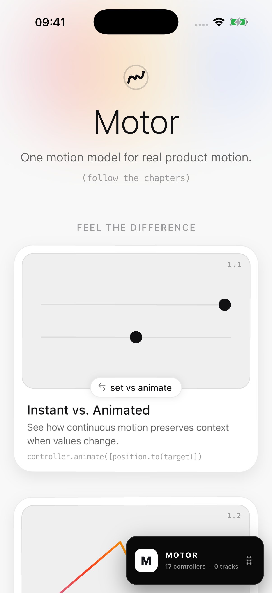
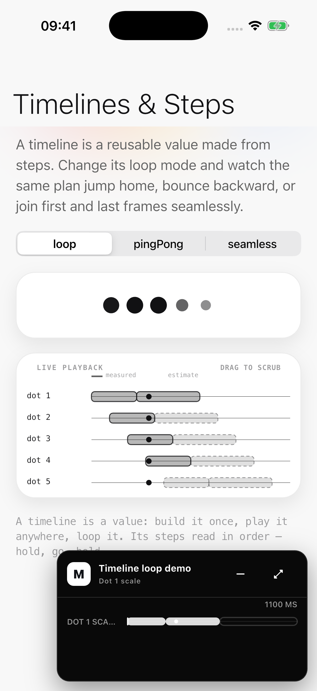
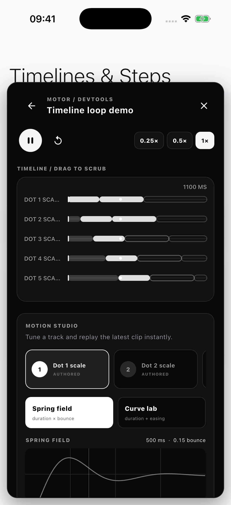
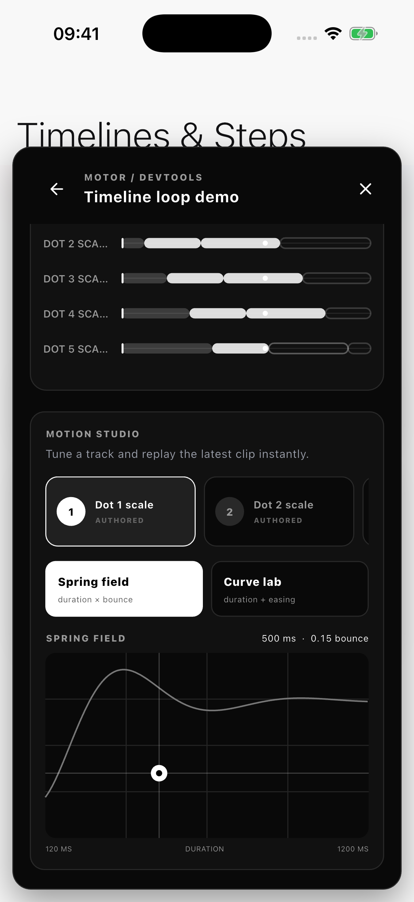
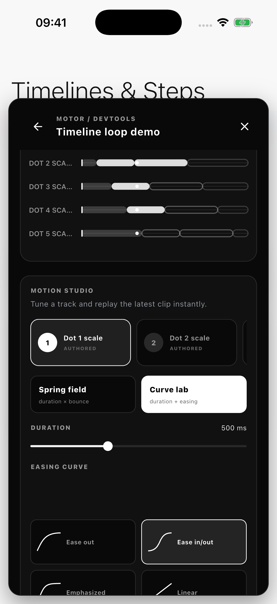

# Motor DevTools

An optional in-app inspector and motion studio for
[`motor`](https://pub.dev/packages/motor). It discovers Motor controllers,
shows their live track timelines, pauses and scrubs playback, and lets a
designer audition motion changes without recompiling the app.

## Use it

Add `motor_devtools` next to `motor`, then wrap the application above the
controllers you want to inspect:

```dart
import 'package:flutter/foundation.dart';
import 'package:motor_devtools/motor_devtools.dart';

MaterialApp(
  builder: (context, child) => MotorDevTools(
    enabled: kDebugMode,
    child: child!,
  ),
  home: const CheckoutPage(),
);
```

The wrapper also works above `MaterialApp` or `CupertinoApp`. The `builder`
position is recommended because it naturally retains the application's media
and localization configuration.

Give controllers and tracks useful names so they are easy to find:

```dart
final controller = TrackController(
  vsync: this,
  debugLabel: 'Checkout confirmation',
);

final cardScale = Track<double>(
  MotionConverter.single,
  initial: 0,
  debugLabel: 'Card scale',
);
```

Open the floating Motor launcher to:

- see every live `TrackController` and `MotionController`;
- drag the launcher anywhere, then snap it to the nearest corner;
- move between a compact status button, a one-track timeline, and the full
  inspector with taps, double taps, buttons, or vertical fling gestures;
- inspect measured and estimated segments in each track timeline;
- pause, drag to scrub, resume, or replay the latest clip;
- run one controller at 0.25×, 0.5×, or full speed;
- select tracks from a tactile card carousel;
- tune spring duration and bounce together on a two-dimensional response field;
- or choose an easing curve and duration in Curve Lab.

Motion Studio changes are session-only. They apply to target-based steps in
the selected track, replay the most recently submitted clip immediately, and
restore the authored motion when reset or when the wrapper is disabled.

## In action

| Compact launcher | One-track peek |
|---|---|
|  |  |

| Timeline and playback | Spring field | Curve Lab |
|---|---|---|
|  |  |  |

## Production builds

`enabled` is a normal runtime flag, so teams can intentionally ship the panel
to testers or customers:

```dart
MotorDevTools(
  enabled: kDebugMode || featureFlags.customerMotionLab,
  child: app,
)
```

When disabled, the wrapper returns its child directly and does not attach the
controller registry. Motor itself retains no global controller collection
until a devtools observer attaches. Apps that do not depend on or import
`motor_devtools` can tree-shake the package entirely.

For a remotely gated production panel, keep the package imported and put the
flag behind an authenticated gesture or feature flag. Do not use controller
debug labels for secrets; they are ordinary strings in the application.
