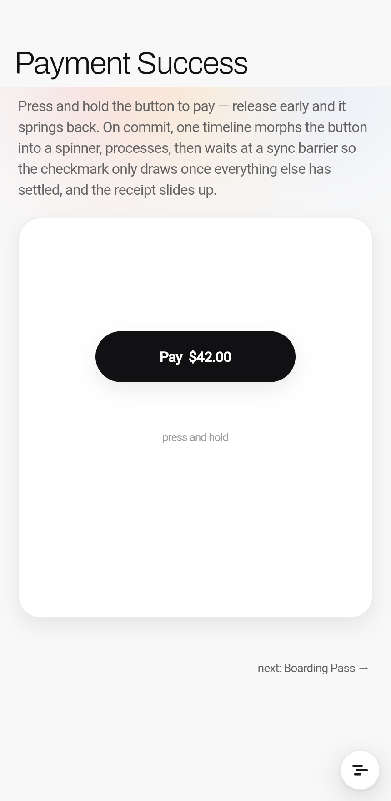
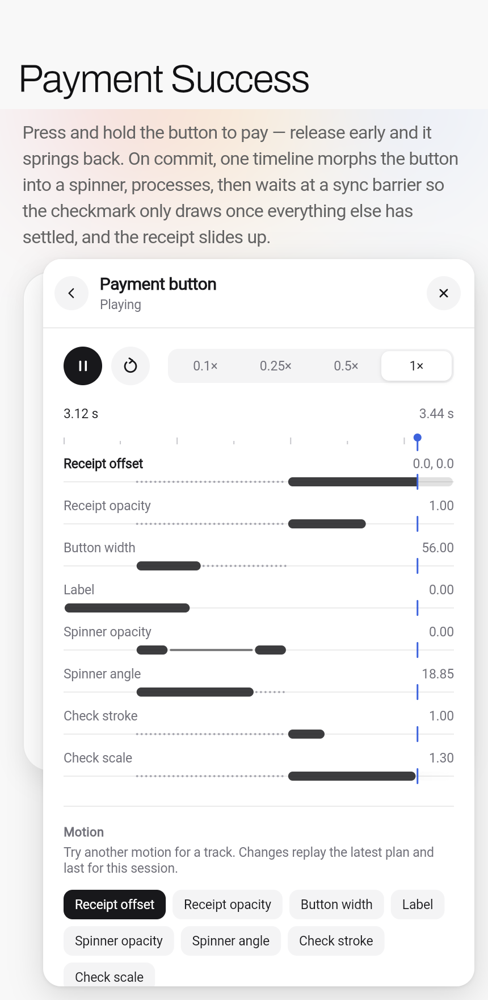
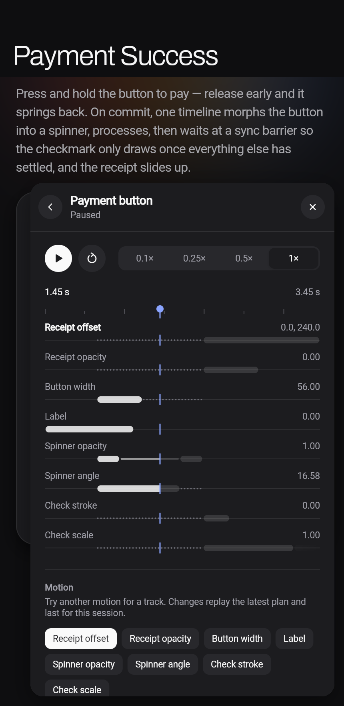

# Motor DevTools

An optional in-app inspector for [`motor`](https://pub.dev/packages/motor).
A small bubble floats above your app. Tap it to see every live Motor
controller; tap a controller to pause it, scrub its timeline, slow it down,
replay it, or try a different motion on one of its tracks.

| Bubble | Controllers | Controller | Scrubbing |
|---|---|---|---|
|  |  |  |  |

## Use it

Add `motor_devtools` next to `motor`, then wrap your app:

```dart
import 'package:flutter/foundation.dart';
import 'package:motor_devtools/motor_devtools.dart';

MaterialApp(
  builder: (context, child) => MotorDevTools(
    enabled: kDebugMode,
    child: child!,
  ),
  home: const CheckoutPage(),
);
```

`MotorDevTools` also works around a `MaterialApp`, `CupertinoApp`, or
`WidgetsApp`. It brings its own neutral styling, follows the platform's light
or dark mode, and does not depend on Material or Cupertino.

## Name your controllers

The list shows each controller's `debugLabel`. In debug builds, unnamed
controllers get a guess: builders are named after the widget that built them
(`CardStack · SingleMotionBuilder`), other controllers after the code that
created them (`CheckoutPage · controller`). Release builds number them
instead. Every controller and builder takes a `debugLabel`, and so does
every track:

```dart
final controller = TrackController(
  vsync: this,
  debugLabel: 'Checkout confirmation',
);

final cardScale = Track<double>(
  .single,
  initial: 0,
  debugLabel: 'Card scale',
);

SingleMotionBuilder(
  value: expanded ? 1 : 0,
  motion: const .smoothSpring(),
  debugLabel: 'Sheet expansion',
  builder: (context, value, child) => ...,
);
```

`MotionController`, `SingleMotionController`, `BoundedMotionController`,
`TrackBuilder`, `PhaseTrackBuilder`, `MotionBuilder`, `VelocityMotionBuilder`
and `MotionDraggable` all accept `debugLabel` too.

## Group or hide controllers

Wrap widgets in a `MotorInspectionScope` to group or hide the controllers that
motor's builders create below it, or set it on a controller directly:

```dart
import 'package:motor/inspection.dart';

// Every button's press feedback shares one row, "Button press ×9".
MotorInspectionScope(
  group: 'Button press',
  child: SingleMotionBuilder(value: pressed ? 0.96 : 1, …),
)

// Leave a controller out of the list entirely.
_spinner = SingleMotionController(motion: spin, vsync: this)
  ..inspectable = false;
```

A controller's own `inspectable` and `inspectionGroup` beat the nearest scope.
A group opens a view with its members and shared controls: pause, replay,
speed and motion. Group speed and motion also apply to members that join
later. Motions match tracks by `debugLabel`; when none of a member's labels
match, they apply to all its tracks. Hidden controllers sit behind an
"N hidden" row.

Without a group, controllers with the same name share one row that unfolds,
and controllers that never played fold into an "N idle" row. "Hide idle" folds
the ones that stopped too, until they play again; modified controllers stay
out.

## What you can do

- **Move the bubble.** Drag it anywhere, or fling it. It settles on the
  nearest side of the screen.
- **See every controller.** The list shows whether each one is playing,
  paused or idle, and which tracks it animates. A controller first shows one
  summary lane; tap "N tracks" for a lane per track. Changed controllers are
  pinned in a Modified section, and controllers whose ticker is muted, such
  as by a `TickerMode` above them, fold into a Muted section.
- **Pause, resume and replay.** Play resumes where you paused or scrubbed to,
  and replays the latest plan once it has finished. Pausing and scrubbing
  last while the controller's page is open; leaving it resumes playback.
- **Scrub.** Drag across the timeline, or tap it, to move the controller to
  that point. Each lane is a track: bars are motions, thin lines are holds,
  dots are waits at a sync barrier. The part left of the playhead has
  played. Looping plans show one cycle at a time.
- **Slow down.** Run one controller at 0.1×, 0.25×, 0.5× or full speed
  without touching Flutter's global time dilation.
- **Try another motion.** Each track row shows its current motion; tap it to
  choose Authored, one of your app's motions, a spring or a curve right under
  that track, or to reset it. Tune springs on a duration × bounce graph with
  a live preview, and copy the resulting code. The latest plan replays right
  away. Pass your own motions by name:

  ```dart
  MotorDevTools(motions: {'Sheet': AppMotion.sheet}, child: app)
  ```

Speed and motion changes last for the session. Changed controllers are
marked in the list, the bubble counts them, and "Reset all" (or Reset on a
controller's page) undoes them. They are also undone when `MotorDevTools` is
disabled or removed.

To open or close the panel from code, pass a `MotorDevToolsController`.

## Show a timeline in your app

`MotorTimeline` is a read-only timeline of one controller, for docs and demos.
Lanes can name, color and merge tracks; the font comes from the surrounding
`DefaultTextStyle`:

```dart
MotorTimeline(
  controller: controller,
  lanes: [
    MotorTimelineLane('Card', [cardOffset], color: Colors.orange),
    MotorTimelineLane('Dots', [dotA, dotB]),
  ],
)
```

## Compiled in, tracking, visible

Three switches, from coarsest to finest:

| Switch | Off means |
| --- | --- |
| `--dart-define=MOTOR_DEVTOOLS=false` (`kMotorDevTools`) | The tools aren't in the build. |
| `enabled:` | Nothing is tracked; the session's changes are undone. |
| `visible:` | The overlay is hidden; tracking and every change go on. |

Keep `enabled` on and toggle `visible` from a debug menu, so the tools
already know every controller, its history, overrides and groups when they
open:

```dart
MotorDevTools(
  enabled: kDebugMode || featureFlags.motionLab,
  visible: debugMenu.showMotorTools,
  child: app,
)
```

Hiding resumes playback the open page paused, as minimizing does.

## Production builds

`enabled` and `visible` are normal runtime flags, so you can deliberately
ship the tools to testers.

When disabled, `MotorDevTools` returns its child and does not attach to
Motor's inspection registry. To remove the tools from a build, build with
`--dart-define=MOTOR_DEVTOOLS=false` (`kMotorDevTools`): the tools, motor's
inspection hooks, groups and scopes all compile away. In the motor example's
release web build that leaves about 400 bytes compared with not importing
the package. Debug labels are plain strings in your app, so don't put secrets
in them.

The tools use motor's inspection API (`package:motor/inspection.dart`), which
is experimental and may change in minor releases.
