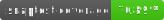

# Snaptest

[](./test/)
[](https://github.com/invertase/melos)
[![lints by lintervention][lintervention_badge]][lintervention_link]

**See what your widgets look like during testing.**


Snaptest is simple: call `snap()` in any widget test to save a screenshot of what's currently on screen. Perfect for debugging, documentation, and visual regression testing.

## Installation 💻

```sh
dart pub add dev:snaptest
```

## The Basics 🚀

### Just call `snap()` to see your screen

Add one line to any widget test to see what it looks like:

```dart
import 'package:flutter_test/flutter_test.dart';
import 'package:snaptest/snaptest.dart';

testWidgets('My widget test', (tester) async {
  await tester.pumpWidget(const MaterialApp(home: MyPage()));
  
  // That's it! Screenshot saved to .snaptest/
  await snap();
});
```

The screenshot gets saved as a PNG file in `.snaptest/` using your test name. Great for debugging failing tests or documenting what your widgets actually look like.

### Configure your `.gitignore`

```gitignore
**/.snaptest/     # Screenshots (usually not committed)
```

## Level Up: Real Rendering 📱

By default, snaptest creates simplified screenshots (blocked text, no images/shadows) for consistency. But you can enable **real rendering** to see exactly what users see:

```dart
testWidgets('Real rendering example', (tester) async {
  await tester.pumpWidget(const MaterialApp(home: MyPage()));
  
  await snap(
    settings: SnaptestSettings.full([
      Devices.ios.iPhone16Pro,
      Devices.android.samsungGalaxyS20,
    ]),
  );
});
```

This creates beautiful screenshots with:
- ✅ Real text rendering
- ✅ Actual images  
- ✅ Shadows and effects
- ✅ Device frames around the content
- ✅ Multiple device sizes
- ✅ Multiple orientations (portrait and landscape)

Perfect for documentation, design reviews, or showing stakeholders what the app actually looks like.

## Level Up: Golden File Testing 🎯

Want automated visual regression testing? Enable golden comparison to catch unintended UI changes:

```dart
testWidgets('Golden comparison test', (tester) async {
  await tester.pumpWidget(const MaterialApp(home: LoginScreen()));
  
  await snap(
    matchToGolden: true,
    settings: SnaptestSettings.full([Devices.ios.iPhone16Pro]),
  );
});
```

This does **both**:
1. **Saves a beautiful screenshot** with real rendering and device frames to `.snaptest/`
2. **Compares against golden files** to fail the test if UI changes unexpectedly

When golden tests fail due to intentional changes, update them:
```sh
flutter test --update-goldens
```

## All the Options 🛠️

### Multiple screenshots per test
```dart
testWidgets('User flow', (tester) async {
  await tester.pumpWidget(const MaterialApp(home: MyPage()));
  await snap('initial_state');
  
  await tester.tap(find.byType(FloatingActionButton));
  await tester.pumpAndSettle();
  await snap('after_tap');
});
```

### Capture specific widgets
```dart
await snap(from: find.byKey(const Key('my-card')));
```

### Global settings for all tests
```dart
void main() {
  setUpAll(() {
    SnaptestSettings.global = SnaptestSettings.full([
      Devices.ios.iPhone16Pro,
    ]);
  });
  
  // All snap() calls now use iPhone 16 Pro with real rendering
}
```

Or create a `flutter_test_config.dart` file to set the global settings:
```dart
import 'dart:async';

Future<void> testExecutable(FutureOr<void> Function() testMain) async {
  SnaptestSettings.global = SnaptestSettings.full([
    Devices.ios.iPhone16Pro,
  ]);

  await testMain();
}
```

### Dedicated screenshot tests with `snapTest`

For tests specifically designed for screenshots, use `snapTest` instead of `testWidgets`. It automatically:
- Adds the `snaptest` tag for easy filtering
- Applies custom settings for the entire test

```dart
import 'package:flutter/material.dart';
import 'package:snaptest/snaptest.dart';

snapTest('Login screen looks correct', (tester) async {
  await tester.pumpWidget(const MaterialApp(home: LoginScreen()));
  await snap(); // Uses the settings from snapTest
});

snapTest(
  'Multi-device homepage',
  (tester) async {
    await tester.pumpWidget(const MaterialApp(home: HomePage()));
    await snap('initial');
    
    await tester.tap(find.byIcon(Icons.menu));
    await tester.pumpAndSettle();
    await snap('menu_open');
  },
  settings: SnaptestSettings.full([
    Devices.ios.iPhone16Pro,
    Devices.android.samsungGalaxyS20,
  ]),
);
```

Run only screenshot tests:
```sh
flutter test --tags snaptest
```

Or exclude them from regular test runs:
```sh
flutter test --exclude-tags snaptest
```

### Test multiple orientations
```dart
testWidgets('Responsive design test', (tester) async {
  await tester.pumpWidget(const MaterialApp(home: MyPage()));
  
  await snap(
    settings: SnaptestSettings.full(
      devices: [Devices.ios.iPhone16Pro],
      orientations: {
        Orientation.portrait,
        Orientation.landscape,
      },
    ),
  );
});
```

This automatically creates separate screenshots for each orientation:
- `my_page_iPhone16Pro_portrait.png`
- `my_page_iPhone16Pro_landscape.png`

### All `snap()` parameters
```dart
await snap(
  name: 'custom_name',           // Custom filename
  from: find.byKey(key),         // Specific widget to capture
  settings: SnaptestSettings(),  // Override global settings
  pathPrefix: 'screenshots/',    // Custom directory (default: '.snaptest/')
  goldenPrefix: 'goldens/',      // Golden files directory (default: 'goldens/')
  matchToGolden: true,           // Enable golden file comparison
);
```

## Settings Reference 📋

### `SnaptestSettings` options:
- **`devices`**: List of devices to test on (default: `[WidgetTesterDevice()]`)
- **`orientations`**: Set of orientations to test (default: `{Orientation.portrait}`)
- **`blockText`**: Whether to block text rendering for consistency (default: `true`)
- **`renderImages`**: Whether to render actual images (default: `false`)
- **`renderShadows`**: Whether to render shadows (default: `false`)
- **`includeDeviceFrame`**: Whether to include device frame around content (default: `false`)

### Convenience constructors:
- **`SnaptestSettings()`**: Default settings - blocked text, no images/shadows/frames
- **`SnaptestSettings.full(devices)`**: Real rendering - actual text, images, shadows, and device frames

## Helper Scripts 🔧

Clean all screenshots:
```sh
dart run snaptest:clean
```

Assemble screenshots into a single directory:
```sh
dart run snaptest:assemble
```

## Font Limitations ⚠️

Due to Flutter's test environment limitations:
- **iOS system fonts** are replaced with Roboto for consistency
- **Google Fonts** only work if bundled as local assets (not fetched remotely)
- **Custom fonts** must be included in your `pubspec.yaml`

This ensures consistent screenshots across environments, but may differ slightly from your actual app.

---

[dart_install_link]: https://dart.dev/get-dart
[github_actions_link]: https://docs.github.com/en/actions/learn-github-actions
[license_badge]: https://img.shields.io/badge/license-MIT-blue.svg
[license_link]: https://opensource.org/licenses/MIT
[mason_link]: https://github.com/felangel/mason
[very_good_ventures_link]: https://verygood.ventures
[lintervention_link]: https://github.com/whynotmake-it/lintervention
[lintervention_badge]: https://img.shields.io/badge/lints_by-lintervention-3A5A40