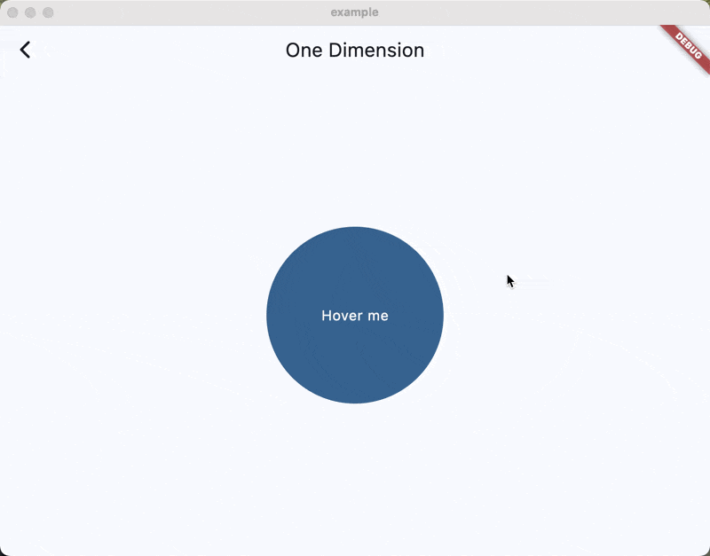
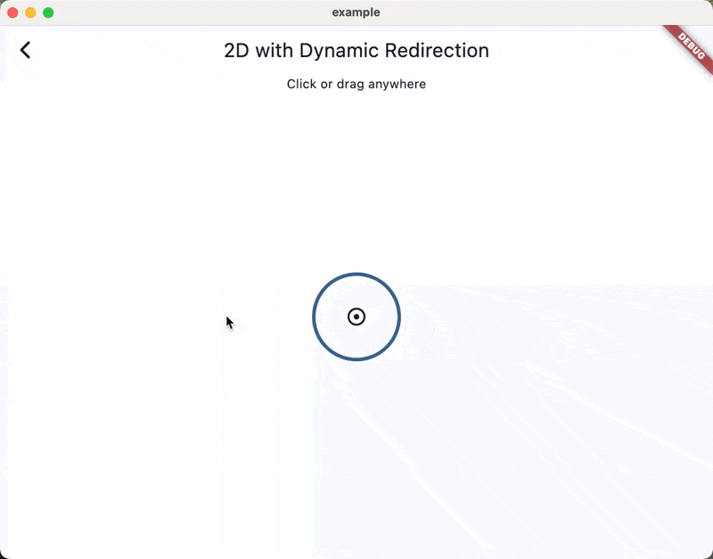
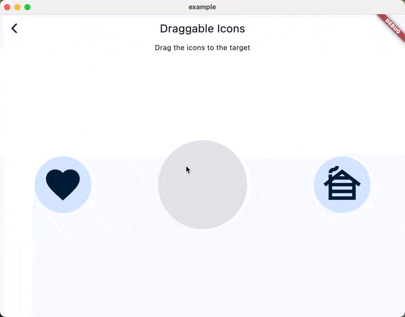

# Springster

[](https://pub.dev/packages/springster)
[](./test/)

Spring animations and simulations, simplified.

> Partially adapted from and heavily inspired by [fluid_animations](https://pub.dev/packages/fluid_animations).

## Features 🎯

- 🎨 Simple spring-based animations with customizable bounce and duration
- 🔄 Spring-based draggable widgets with smooth return animations
- 🎯 Spring curves for use with standard Flutter animations
- 📱 2D spring animations for complex movements

## Installation 💻

**❗ In order to start using Springster you must have the [Dart SDK][dart_install_link] installed on your machine.**

Add to your `pubspec.yaml`:

```yaml
dependencies:
  springster: ^latest_version
```

Or install via `dart pub`:

```sh
dart pub add springster
```

## Usage 💡

### Simple Spring Animation

Use `SpringBuilder` for basic spring animations:



```dart
SpringBuilder(
  spring: SimpleSpring.bouncy,
  value: targetValue, // Changes trigger smooth spring animation
  builder: (context, value, child) {
    return Container(
      width: value,
      height: value,
      color: Colors.blue,
    );
  },
)
```

If you want a simple two-dimensional spring animation, you can use `SpringBuilder2D`:



```dart
SpringBuilder2D(
  spring: SimpleSpring.bouncy,
  value: (100, 100), // Changes trigger smooth spring animation and redirect dynamically
  builder: (context, value, child) {
    return Transform.translate(
      offset: Offset(value.x, value.y),
      child: child,
    );
  },
  child: Container(
    width: 100,
    height: 100,
    color: Colors.blue,
  ),
)
```

### Spring Draggable

`springster` comes with a `SpringDraggable` widget that allows you to drag a widget around the screen with a spring return animation.
It works just like the `Draggable` widget in Flutter and supports native Flutter `DragTarget`s, however it comes with a few sensible defaults and extra features.



```dart
SpringDraggable(
  spring: SimpleSpring.bouncy,
  child: Container(
    width: 100,
    height: 100,
    color: Colors.blue,
  ),
  data: 'my-draggable-data',
)
```

### Low-level Spring Simulation

If you need more control over the spring simulation, you can use the `SpringSimulationController` and `SpringSimulationController2D` classes.

```dart
final controller = SpringSimulationController(
  spring: SimpleSpring.bouncy,
  vsync: this,
);
```

They work similarly to the `AnimationController` class in Flutter and allow you to drive the spring simulation with a target value, while maintaining velocity between target changes.

## Predefined Springs 🎯

Springster comes with several predefined spring configurations:

- `const SimpleSpring()` - Smooth spring with no bounce
- `SimpleSpring.instant` - An effectively instant spring
- `SimpleSpring.defaultIOS` - iOS-style smooth spring with no bounce
- `SimpleSpring.bouncy` - Spring with higher bounce
- `SimpleSpring.snappy` - Snappy spring with small bounce
- `SimpleSpring.interactive` - Lower response spring for interactive animations

You can also create custom springs:

```dart
const mySpring = SimpleSpring(
  duration: 0.5, // Settling duration
  bounce: 0.2,   // Bounce amount (-1 to 1)
);

// Or using damping fraction
const mySpring = SimpleSpring.withDamping(
  dampingFraction: 0.7,
  duration: 0.5,
);
```


[dart_install_link]: https://dart.dev/get-dart
[mason_link]: https://github.com/felangel/mason
[melos_link]: https://github.com/invertase/melos
